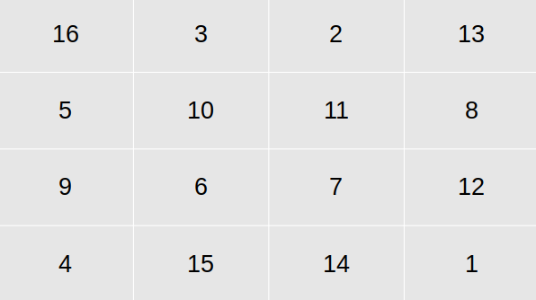

# HW03b - Multidimensional Arrays - Magic Squares

_A second stab at working with multi-dimensional arrays and magic squares._

## Background

A **magic square of order n** is an *n* x *n* square array containing the integers 1, 2, 3, ..., *n*^2 arranged so that the sum of each row, each column and each diagonal are all the same. One example is the following magic square of order 4 in which each row, each column, and each diagonal adds up to 34:



It is famous because it appeared in the well-know engraving by Albrecht Durer entitiled _Melancholia_.

## Objective

In this assignment, you will use problems related to magic squares to gain familiarity with the manipulation of two-dimensional arrays. The first problem will be that of testing a magic square, and the second will involve in generating a magic square.

## Getting Started

Before starting work on the _magic square checker_ and the _magic square constructor_, we will review two-dimensional arrays and write an output function that displays them.

Also before you get started, be sure to checkout the `feedback` branch which as already been created for you by GitHub Classroom. Push all your changes to this `feedback` branch. Upon completion of your work you will create a _pull request_ that seeks to merge your changes in your `feedback` branch into your `master` branch.

## Part 1: Two-Dimensional Array Printer

Two-dimensional arrays can be declared with declarations of the form

```c++
element-type array-name[NUM_ROWS][NUM_COLUMNS];
```

But it is preferable to use a `typedef`, such as

```c++
typedef element-type Typenmae[NUM_ROWS][NUM_COLUMNS];
```

Then when we want to use that kind of type, we can just make declarations of the form

```c++
Typename array-name;
```

Get started by noting in the [magic_square.h](include/magic_square.h) header file:

* Declarations of `int` constants `NUM_ROWS` and `NUM_COLUMNS` (each = 15) and a `typedef` statement to define `TwoDimArray` to be a `NUM_ROWS` x `NUM_COLUMNS` array of integers.

Next, work on your implementation of the `PrintTable` function that is a member of the `csc232` namespace. This work, and all your work in this lab, is to be done in the [magic_squares.cpp](src/magic_square.cpp) implementation file.

_Hints_: 

* Use either [Main.cpp](src/Main.cpp) or [Demo.cpp](src/Demo.cpp) to test your function. Alternatively, run the `PrintTableTestFixture` Google Test fixture.
* Note that each value of the table is printed in a field width of 5 spaces. Consider using the `setw(int)` function imported from the `iomanip` library to facilitate your correct output.
* Take a look at which specific objects are available for direct use in the [csc232.h](include/csc232.h) header file. For example, due to the `using` statements, you can directly use `cout` without the need for the `std::` prefix.

When you have completed this part of the lab, commit your changes and push them to GitHub.

## Part 2: A Magic Square Checker Function

Now you are ready to go on and write a magic square checker function. Remember that a magic square is an *n* x *n* square matrix containing the first *n*^2 positive integers in which the rows, columns, and diagonals all sum to the same number. You can figure what this sum should be recognizing that there are 2*n* + 2 such sums (*n* rows, *n* columns, and 2 diagonals). The sum of all the numbers in the magic square, 1 + 2 + ... + *n*^2, is equal to (*n*^2 * (*n*^2 + 1))/2. If we sum all of the *n* rows (or *n* columns), we will be summing all numbers in the magic square, which means that each of the rows (and columns and diagonals) must total 1/*n* of the full sum. Thus the sum of each row, each column, and each diagonal must be

*n* * (*n*^2 + 1)/2

For the case of our 3 x 3 example, this is

3 * (3^2 + 1) / 2 = (3 * 10) / 2 = 15

So if you were to write pseudo code for your magic square checker, it might look something like:

1. Pass the array to be checked to the function along with its size.
1. Calculate the expected value of the row, column, and diagonal sums (using the above formula).
1. Check each row to see if its sum equals the required sum.
1. If any one of these fails, this is not a magic square; return false.
1. Similarly, check each column and each of the two diagonals.
1. If all rows, columns, and diagonals sum to the same number, return true and pass back the magic sum, which is the sum we calculated above.

The above strategy can be facilitated by implementing the following functions next in [magic_squares.cpp](src/magic_square.cpp):

* `int csc232::CalcMagicSquareSum(int order)`
* `int csc232::CalcRowTotal(const csc232::TwoDimArray square, int order, int row)`
* `bool csc232::CheckRows(const csc232::TwoDimArray square, int order, int expected)`
* `int csc232::CalcColTotal(const csc232::TwoDimArray square, int order, int col)`
* `bool csc232::CheckCols(const csc232::TwoDimArray square, int order, int expected)`
* `int csc232::CalcLRDiagTotal(const csc232::TwoDimArray square, int order)`
* `bool csc232::CheckLRDiag(const csc232::TwoDimArray square, int order, int expected)`
* `int csc232::CalcRLDiagTotal(const csc232::TwoDimArray square, int order)`
* `bool csc232::CheckRLDiag(const csc232::TwoDimArray square, int order, int expected)`
* `bool csc232::IsMagicSquare(const csc232::TwoDimArray square, int order)`

It is _highly suggested_ you implement these functions in the order they appear. See the hints in each stub for the reasons why. Furthermore, to get full credit for this assignment, you _must_ implement each of these functions, regardless if some are reused in your implementations.

_Hint_: Use either [Main.cpp](src/Main.cpp) or [Demo.cpp](src/Demo.cpp) to test your function. Alternatively, run the Google Test test fixtures that correspond to each function.

When you have completed this part of the lab, commit your changes and push them to GitHub. Better yet, commit every time you properly implement one of the aforementioned functions.

## Part 3: A Magic Square Constructor

Now that you can check a magic square, you need a way to construct one. The following is a procedure for constructing an *n* x *n* magic square of and _odd_ integer _n_. 

Place 1 in the middle of the top row. Then after integer _k_ has been placed, move up one row and one column to the right to place the next integer _k_ + 1, unless one of the following occurs:

* If a move takes you above the top row in the *j*th column, move to the both of the *j*th column and place *k* + 1 there.
* If a move takes you outside to the right of the square in the *i*th row, place *k* + 1 at the left side.
* If a move takes you to an already filled square or if you move out of the square at the upper right-hand corner, place *k* + 1 immediately below *k*.

Now, use this description of how to create a magic square to construct _by hand_ a magic square of order 3 and then of order 5, to ensure that you understand the algorithm.

The above strategy can be facilitated by implementing the following functions next in [magic_squares.cpp](src/magic_square.cpp):

* `void csc232::InitializeMagicSquare(csc232::TwoDimArray table, int order)`
* `bool csc232::IsValidCoordinate(int coord, int order)`
* `void csc232::SetNextLocation(const csc232::TwoDimArray table, std::pair<int, int>& currentLocation, int order)` -- this function makes use of the `std::pair` ADT. See [Demo.cpp](src/Demo.cpp) for a demonstration of working with this simple ADT.
* `void csc232::CreateMagicSquare(csc232::TwoDimArray table, int order)`

It is _highly suggested_ you implement these functions in the order they appear. See the hints in each stub for the reasons why. Furthermore, to get full credit for this assignment, you _must_ implement each of these functions, regardless if some are reused in your implementations.

_Hint_: Use either [Main.cpp](src/Main.cpp) or [Demo.cpp](src/Demo.cpp) to test your function. Alternatively, run the Google Test test fixtures that correspond to each function.

When you have completed this part of the lab, commit your changes and push them to GitHub. Better yet, commit every time you properly implement one of the aforementioned functions.
## Submission Details

As usual, prior to submitting your assignment to Teams, be sure that you have commited and pushed your final changes to GitHub. Once your final changes have been pushed, create a pull request that seeks to merge the changes in your `feedback` branch into your `master` branch. Once your pull request has been created, submit the URL of your assignment _repository_ (i.e., _not_ the URL of the pull request) as a Link Resource in Teams. Please note: the timestamp of the submission on Teams is used to assess any late penalties if and when warrented, _not_ the date/time you create your pull request. **No more exceptions will be granted for this oversight**.

### Due Date

Your Teams submission is due by 11:59 PM, Monday, 23 March 2020.

### Grading Rubric

This assignment is worth **5 points**.

All homework assignments are graded on the following general rubric:

* (Up to) 1 point is earned for creating the pull request and submitting your repositories URL into the Teams assignment by the due date.
* (Up to) 1 point is earned for proper coding style (I suggest importing this [style scheme](resource/csc232_clion_cpp_code_style.xml) and let CLion do the formatting for you)
* (Up to) 3 points are earned for program correctness; the points are determined by the degree to which your solution passes the unit tests.

### Late Penalty

In the first 24 hour period following the due date, this lab will be penalized 1 point meaning the grading starts at 4 (out of 5 total possible) points.

In the second 24 hour period following the due date, this lab will be penalized 2 points meaning the grading starts at 3 (out of 5 total possible) points.

After 48 hours, the assignment will not be graded and thus earns no points, i.e., 0 out of 5 possible points.
